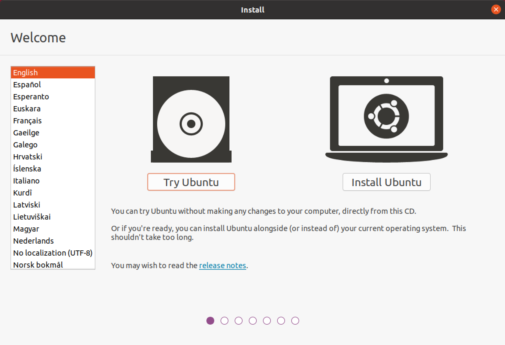
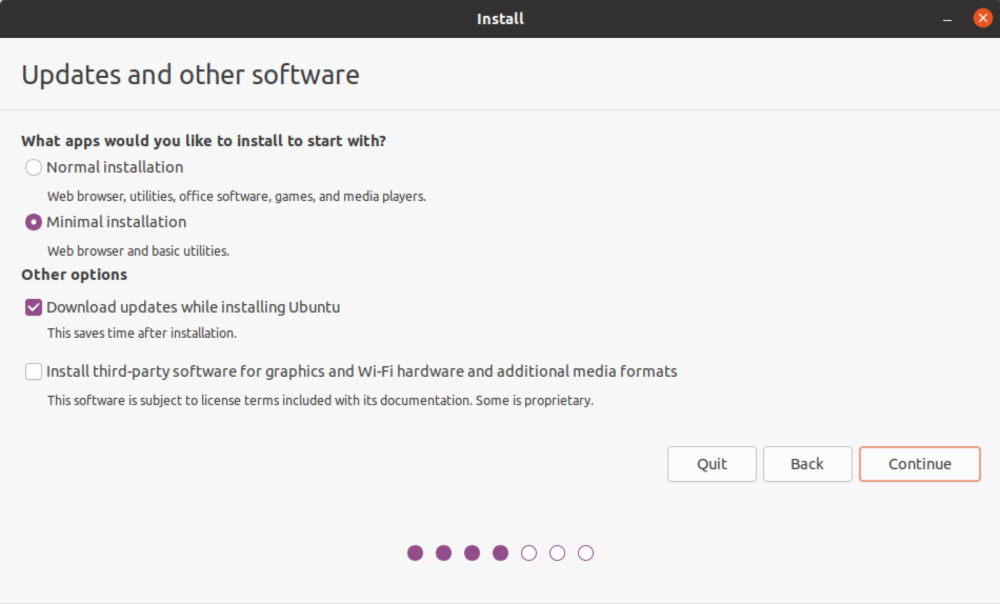
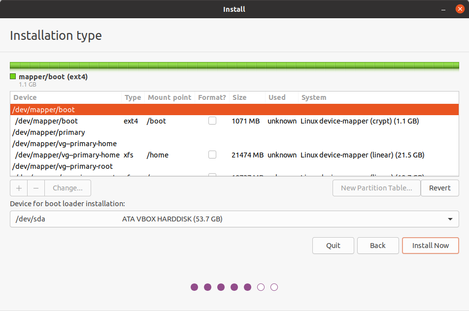
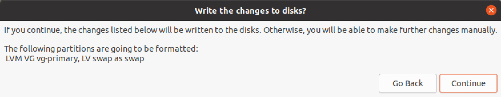
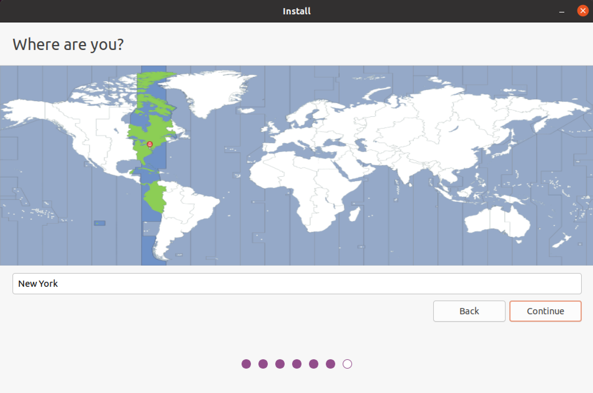
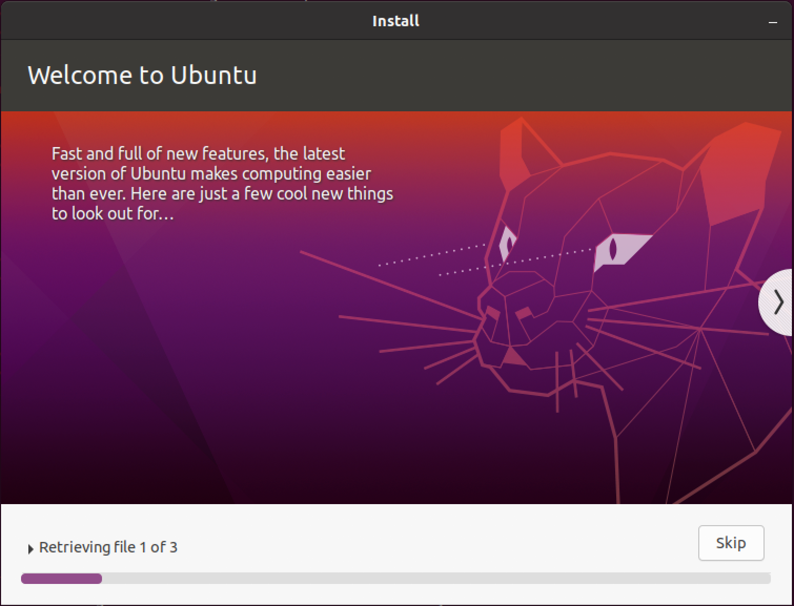

Full Disk Encryption Setup
==========================

This manual describes an installation procedure of Ubuntu 20.04 LTS with full
disk encryption.

This manual is based on [Full_Disk_Encryption_Howto_2019][FDE] guide.

[FDE]: https://help.ubuntu.com/community/Full_Disk_Encryption_Howto_2019

In this document the following drive partitioning is performed:

*   drive #1 (SSD) -- `/dev/sda`:

    | Partition # | Content                        |
    | ----------- | ------------------------------ |
    | 1           | Encrypted (LUKS) primary LVM   |

*   drive #2 (HDD) -- `/dev/sdb`:

    | Partition # | Content                             |
    | ----------- | ----------------------------------- |
    | 1           | EFI system partition                |
    | 2           | Encrypted (LUKS) `/boot` filesystem |
    | 3           | Encrypted (LUKS) secondary LVM      |

The drive #1 primary LVM logical volumes:

*   root filesystem
*   swap

The drive #2 secondary LVM logical volumes:

*   `/home` filesystem

The setup instructions:

1.  Boot in UEFI mode from installation media and choose "Try Ubuntu":

    

2.  Open terminal application and switch to root session:

    ```sh
    sudo -i
    ```

3.  Wipe the drives with random data:

    ```sh
    shred \
        --verbose \
        --iterations=3 \
        --random-source=/dev/urandom \
        /dev/sda

    shred \
        --verbose \
        --iterations=3 \
        --random-source=/dev/urandom \
        /dev/sdb
    ```

4.  Partition the drive #1 according to the following scheme:

    | Part. # | Name    | Type                 | Size           |
    | ------- | ------- | -------------------- | -------------- |
    | 1       | primary | Linux LUKS           | All free space |

    ```sh
    sgdisk --zap-all /dev/sda
    sgdisk --new=0:0:0 /dev/sda
    sgdisk --change-name=1:primary /dev/sda
    sgdisk --typecode=1:8309 /dev/sda
    ```

5.  Partition the drive #2 according to the following scheme:

    | Part. # | Name      | Type                 | Size                 |
    | ------- | --------- | -------------------- | -------------------- |
    | 1       | esp       | EFI system partition | 1G                   |
    | 2       | boot      | Linux LUKS           | 1G                   |
    | 3       | secondary | Linux LUKS           | Remaining free space |

    ```sh
    sgdisk --zap-all /dev/sdb

    sgdisk --new=0:0:+1G /dev/sdb
    sgdisk --new=0:0:+1G /dev/sdb
    sgdisk --new=0:0:0 /dev/sdb

    sgdisk --change-name=1:esp /dev/sdb
    sgdisk --change-name=2:boot /dev/sdb
    sgdisk --change-name=3:secondary /dev/sdb

    sgdisk --typecode=1:ef00 /dev/sdb
    sgdisk --typecode=2:8309 /dev/sdb
    sgdisk --typecode=3:8309 /dev/sdb
    ```

6.  Initialize LUKS partitions according to the following scheme:

    | Drive # | Partition # | Device      | LUKS version |
    | ------- | ----------- | ----------- | ------------ |
    | 1       | 1           | `/dev/sda1` | 2            |
    | 2       | 2           | `/dev/sdb2` | 1            |
    | 2       | 3           | `/dev/sdb3` | 2            |

    ```sh
    dd if=/dev/zero of=primary.img bs=16M count=1
    cryptsetup luksFormat --type=luks2 --offset=32768 --header=primary.img /dev/sda1
    cryptsetup luksFormat --type=luks1 /dev/sdb2
    cryptsetup luksFormat --type=luks2 /dev/sdb3
    ```

    See [Section 2.20 "How do I wipe only the LUKS header?"][LUKS FAQ] of LUKS
    FAQ for details about header size.

    [LUKS FAQ]: https://gitlab.com/cryptsetup/cryptsetup/-/blob/c40be6cc7a830f95cbea336693bbcabd101df135/FAQ#L820

7.  Open the initialized LUKS partitions as the following devices:

    | Drive # | Partition # | Device      | LUKS device             |
    | ------- | ----------- | ----------- | ----------------------- |
    | 1       | 1           | `/dev/sda1` | `/dev/mapper/primary`   |
    | 2       | 2           | `/dev/sdb2` | `/dev/mapper/boot`      |
    | 2       | 3           | `/dev/sdb3` | `/dev/mapper/secondary` |

    ```sh
    cryptsetup open --header=primary.img /dev/sda1 primary
    cryptsetup open /dev/sdb2 boot
    cryptsetup open /dev/sdb3 secondary
    ```

8.  Initialize `esp` and `boot` partitions according to the following scheme:

    | Device             | FS    |
    | ------------------ | ----- |
    | `/dev/sdb1`        | FAT32 |
    | `/dev/mapper/boot` | ext4  |

    ```sh
    mkfs.vfat -F 32 /dev/sdb1
    mkfs.ext4 /dev/mapper/boot
    ```

9.  Initialize `primary` partition (`/dev/mapper/primary` device) with
    `vg-primary` LVM volume group according to the following scheme:

    | Logical Volume | Size | FS   |
    | -------------- | ---- | ---- |
    | root           | 10G  | XFS  |
    | swap           | 8G   | swap |

    ```sh
    pvcreate /dev/mapper/primary

    vgcreate vg-primary /dev/mapper/primary

    lvcreate --name=root --size=10G vg-primary
    lvcreate --name=swap --size=8G vg-primary

    mkfs.xfs /dev/vg-primary/root
    mkswap /dev/vg-primary/swap
    ```

10. Initialize `secondary` partition (`/dev/mapper/secondary` device) with
    `vg-secondary` LVM volume group according to the following scheme:

    | Logical Volume | Size | FS  |
    | -------------- | ---- | --- |
    | home           | 20G  | XFS |

    ```sh
    pvcreate /dev/mapper/secondary
    vgcreate vg-secondary /dev/mapper/secondary
    lvcreate --name=home --size=20G vg-secondary
    mkfs.xfs /dev/vg-secondary/home
    ```

11. Start Ubuntu installation:

    

12. Choose the preferred language:

    

13. Choose the keyboard layout:

    

14. Choose the options for updates and other software:

    

15. In "Installation type" window choose "Something else":

    

16. Configure the following options:

    | Device                         | Type | Mount Point | Format |
    | ------------------------------ | ---- | ----------- | ------ |
    | /dev/mapper/boot               | ext4 | /boot       | no     |
    | /dev/mapper/vg--primary-root   | xfs  | /           | no     |
    | /dev/mapper/vg--primary-swap   | swap |             | no     |
    | /dev/mapper/vg--secondary-home | xfs  | /home       | no     |
    | /dev/sdb1                      | efi  |             | no     |

    Device for boot loader installation: `/dev/sdb`.

    

    

    

17. Configure timezone:

    

18. Configure hostname and user account:

    

19. When installation starts, enable `grub-mkconfig` and `grub-install` to check
    for encrypted disks.

    **Warning.** This has to be done before the installer reaches bootloader
    installation stage.

    

    Run the following commands in terminal:

    ```sh
    while [ ! -d /target/etc/default/grub.d ]; do
        sleep 1
    done; \
    echo "GRUB_ENABLE_CRYPTODISK=y" > /target/etc/default/grub.d/cryptodisk.cfg
    ```

20. When the installation is complete, select "Continue Testing":

    

21. Chroot to installed system:

    ```sh
    mount /dev/vg-primary/root /target

    mkdir --mode=500 /target/etc/luks
    cp primary.img /target/etc/luks/primary.img
    chmod 600 /target/etc/luks/primary.img

    for path in proc sys dev etc/resolv.conf; do
        mount --rbind /$path /target/$path
    done
    chroot /target
    mount --all
    ```

22. Configure encrypted devices to be unlocked automatically.

    Ensure that `cryptsetup-initramfs` package is installed:

    ```sh
    apt install cryptsetup-initramfs
    ```

    Set the following option in `/etc/cryptsetup-initramfs/conf-hook`:

    ```sh
    KEYFILE_PATTERN="/etc/luks/*.key"
    ```

    Create file `/etc/initramfs-tools/conf.d/umask` with the following content:

    ```sh
    UMASK=0077
    ```

    Create executable file `/etc/initramfs-tools/hooks/cryptheader` with content
    from `${project_root}/initramfs/cryptheader`:

    ```sh
    chmod +x /etc/initramfs-tools/hooks/cryptheader
    ```

    Create and configure keys:

    ```sh
    dd if=/dev/urandom of=/etc/luks/boot.key bs=512 count=1
    dd if=/dev/urandom of=/etc/luks/primary.key bs=512 count=1
    dd if=/dev/urandom of=/etc/luks/secondary.key bs=512 count=1
    chmod 400 /etc/luks/*.key

    cryptsetup luksAddKey --header=/etc/luks/primary.img /dev/sda1 /etc/luks/primary.key
    cryptsetup luksAddKey /dev/sdb2 /etc/luks/boot.key
    cryptsetup luksAddKey /dev/sdb3 /etc/luks/secondary.key

    BOOT_UUID=$(blkid --match-tag=UUID --output=value /dev/sdb2)
    echo "boot UUID=$BOOT_UUID /etc/luks/boot.key luks" > /etc/crypttab

    PRIMARY_PARTUUID=$(blkid --match-tag=PARTUUID --output=value /dev/sda1)
    echo "primary PARTUUID=$PRIMARY_PARTUUID /etc/luks/primary.key luks,header=/etc/luks/primary.img" >> /etc/crypttab

    SECONDARY_UUID=$(blkid --match-tag=UUID --output=value /dev/sdb3)
    echo "secondary UUID=$SECONDARY_UUID /etc/luks/secondary.key luks" >> /etc/crypttab

    update-initramfs -u -k all
    ```

23. Reboot.
