System Installation
===================

The following instructions describe an installation procedure of Ubuntu 20.04
LTS with full disk encryption enhanced by extboot.

This manual is based on [Full_Disk_Encryption_Howto_2019][FDE] guide.

[FDE]: https://help.ubuntu.com/community/Full_Disk_Encryption_Howto_2019

Device naming that is used in this document:

| Device     | Drive          |
| ---------- | -------------- |
| `/dev/sda` | Internal drive |
| `/dev/sdb` | External drive |

External drive partitioning:

| Partition # | Content              |
| ----------- | -------------------- |
| 1           | EFI system partition |
| 2           | Recovery data        |

Internal drive partitioning:

| Partition # | Content                             |
| ----------- | ----------------------------------- |
| 1           | Reserved                            |
| 2           | Encrypted (LUKS) `/boot` filesystem |
| 3           | Encrypted (LUKS) LVM                |

Internal drive LVM logical volumes:

*   root filesystem
*   `/home` filesystem
*   swap

Also there is a special loop device (`/dev/loop78`) with staging ESP. When OS is
booted up this device is mounted to `/boot` instead of the external drive ESP.
When EFI applications (shim or GRUB) are updated, they are first updated on the
staging ESP. When the external drive is connected, its ESP is synced with the
staging ESP.

Installation instructions:

1.  Boot in UEFI mode from installation media and choose "Try Ubuntu":

    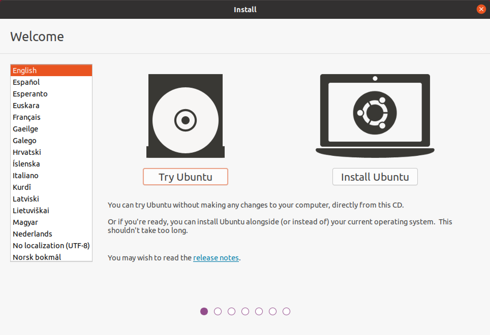

2.  Open terminal application and switch to root session:

    ```sh
    sudo -i
    ```

3.  Wipe the internal drive with random data:

    ```sh
    shred \
        --verbose \
        --iterations=3 \
        --random-source=/dev/urandom \
        /dev/sda
    ```

4.  Partition the internal drive according to the following scheme:

    | Part. # | Name               | Type             | Size                 |
    | ------- | ------------------ | ---------------- | -------------------- |
    | 1       | extboot-reserved-1 | Linux filesystem | 1G                   |
    | 2       | boot               | Linux LUKS       | 1G                   |
    | 3       | primary            | Linux LUKS       | Remaining free space |

    ```sh
    sgdisk --zap-all /dev/sda

    sgdisk --new=0:0:+1G /dev/sda
    sgdisk --new=0:0:+1G /dev/sda
    sgdisk --new=0:0:0 /dev/sda

    sgdisk --change-name=1:extboot-reserved-1 /dev/sda
    sgdisk --change-name=2:boot /dev/sda
    sgdisk --change-name=3:primary /dev/sda

    sgdisk --typecode=1:8300 /dev/sda
    sgdisk --typecode=2:8309 /dev/sda
    sgdisk --typecode=3:8309 /dev/sda
    ```

5.  Initialize LUKS partitions according to the following scheme:

    | Partition # | Device      | LUKS version |
    | ----------- | ----------- | ------------ |
    | 2           | `/dev/sda2` | 1            |
    | 3           | `/dev/sda3` | 2            |

    ```sh
    cryptsetup luksFormat --type=luks1 /dev/sda2
    cryptsetup luksFormat --type=luks2 /dev/sda3
    ```

6.  Open the initialized LUKS partitions as the following devices:

    | Partition # | Device      | LUKS device           |
    | ----------- | ----------- | --------------------- |
    | 2           | `/dev/sda2` | `/dev/mapper/boot`    |
    | 3           | `/dev/sda3` | `/dev/mapper/primary` |

    ```sh
    cryptsetup open /dev/sda2 boot
    cryptsetup open /dev/sda3 primary
    ```

7.  Initialize `boot` partition to the following scheme:

    | Device             | FS           |
    | ------------------ | ------------ |
    | `/dev/mapper/boot` | ext4         |

    ```sh
    mkfs.ext4 /dev/mapper/boot
    ```

8.  Initialize `primary` partition (`/dev/mapper/primary` device) with
    `vg-primary` LVM volume group according to the following scheme:

    | Volume         | Size | FS    |
    | -------------- | ---- | ----- |
    | root           | 10G  | XFS   |
    | home           | 20G  | XFS   |
    | swap           | 8G   | swap  |

    ```sh
    pvcreate /dev/mapper/primary

    vgcreate vg-primary /dev/mapper/primary

    lvcreate --name=root --size=10G vg-primary
    lvcreate --name=home --size=20G vg-primary
    lvcreate --name=swap --size=8G vg-primary

    mkfs.xfs /dev/vg-primary/root
    mkfs.xfs /dev/vg-primary/home
    mkswap /dev/vg-primary/swap
    ```

9.  Connect external drive.

10. Partition the external drive according to the following scheme:

    | Partition # | Name     | Type                 | Size                 |
    | ----------- | -------- | -------------------- | -------------------- |
    | 1           | esp      | EFI system partition | 1G                   |
    | 2           | recovery | Linux filesystem     | Remaining free space |

    ```sh
    sgdisk --zap-all /dev/sdb

    sgdisk --new=0:0:+1G /dev/sdb
    sgdisk --new=0:0:0 /dev/sdb

    sgdisk --change-name=1:esp /dev/sdb
    sgdisk --change-name=2:recovery /dev/sdb

    sgdisk --typecode=1:ef00 /dev/sdb
    sgdisk --typecode=2:8300 /dev/sdb
    ```

11. Initialize partitions according to the following scheme:

    | Partition # | Device      | FS    | Label       |
    | ----------- | ----------- | ----- | ----------- |
    | 1           | `/dev/sdb1` | FAT32 | EB-ESP      |
    | 2           | `/dev/sdb2` | XFS   | EB-RECOVERY |

    ```sh
    mkfs.vfat -F 32 -n EB-ESP /dev/sdb1
    mkfs.xfs -L EB-RECOVERY /dev/sdb2
    ```

12. Start Ubuntu installation:

    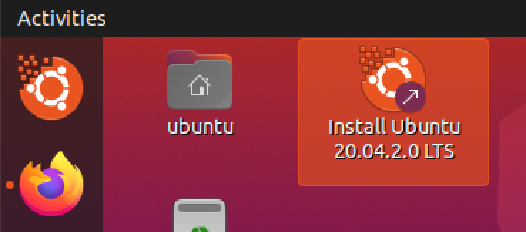

13. Choose the preferred language:

    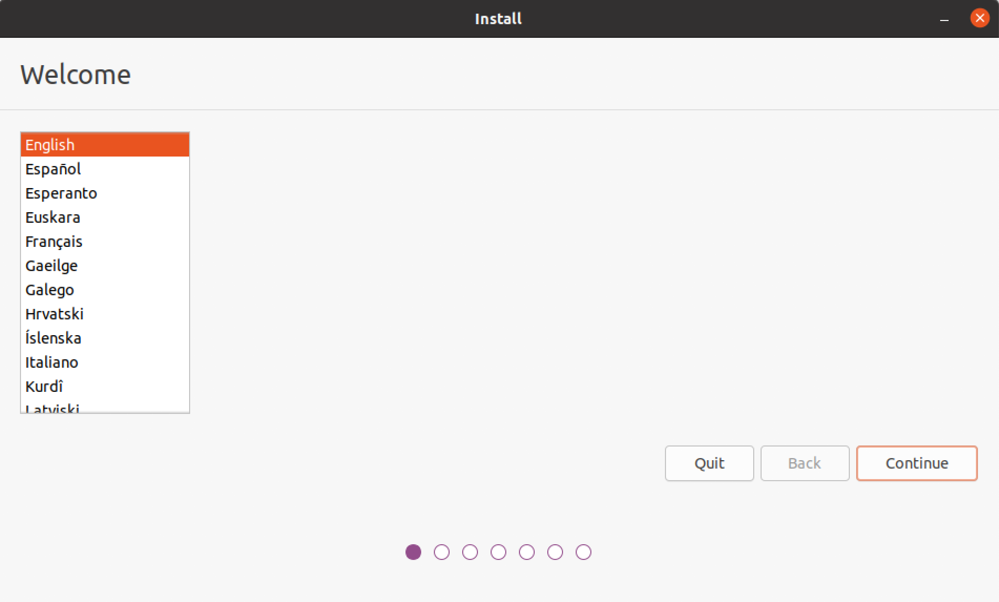

14. Choose the keyboard layout:

    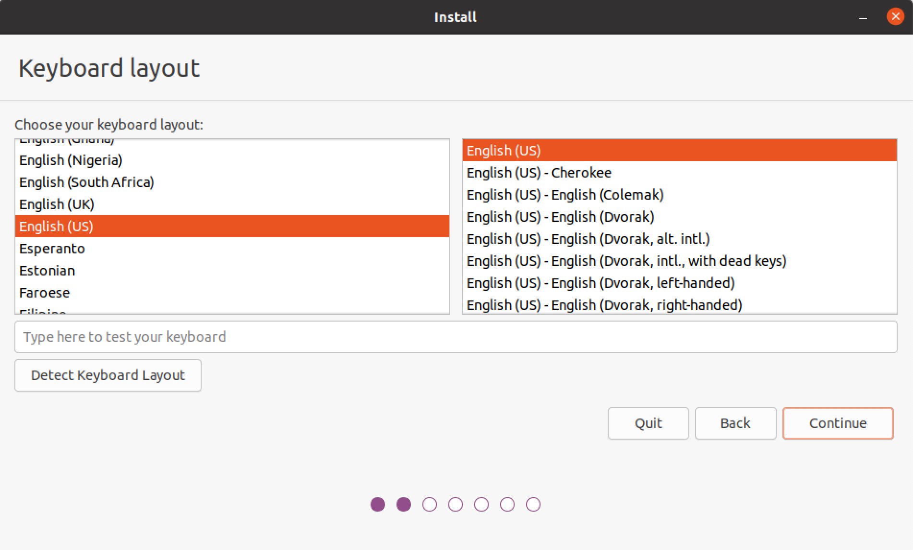

15. Choose the options for updates and other software:

    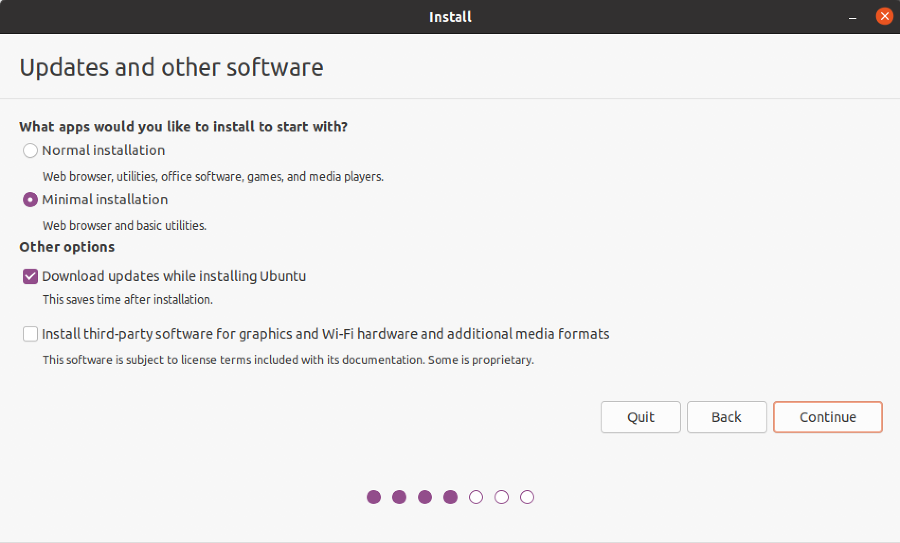

16. In "Installation type" window choose "Something else":

    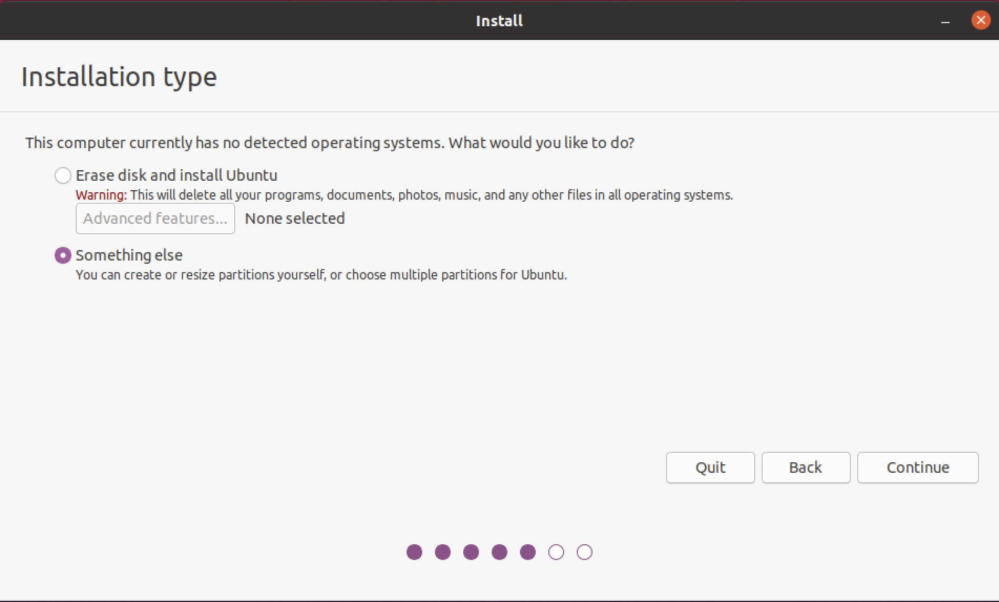

17. Configure the following options:

    | Device                               | Type  | Mount Point | Format |
    | ------------------------------------ | ----- | ----------- | ------ |
    | /dev/mapper/boot                     | ext4  | /boot       | no     |
    | /dev/mapper/vg--primary-home         | xfs   | /home       | no     |
    | /dev/mapper/vg--primary-root         | xfs   | /           | no     |
    | /dev/mapper/vg--primary-swap         | swap  |             | no     |
    | /dev/sdb1                            | efi   |             | no     |
    | /dev/sdb2                            | xfs   |             | no     |

    Device for boot loader installation: `/dev/sdb`.

    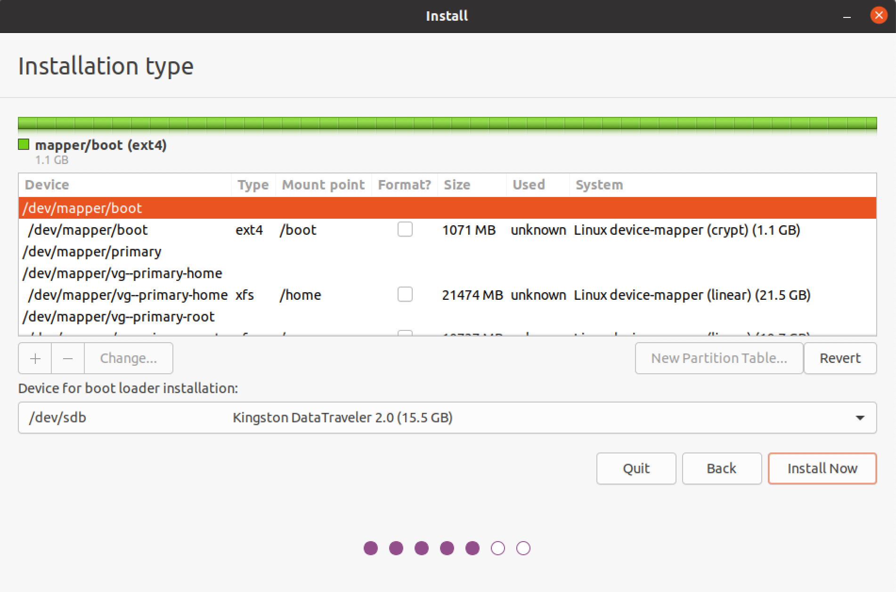

    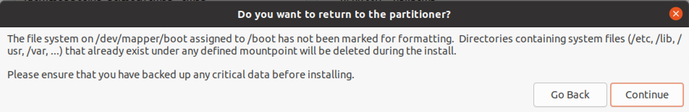

    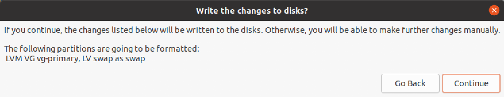

18. Configure timezone:

    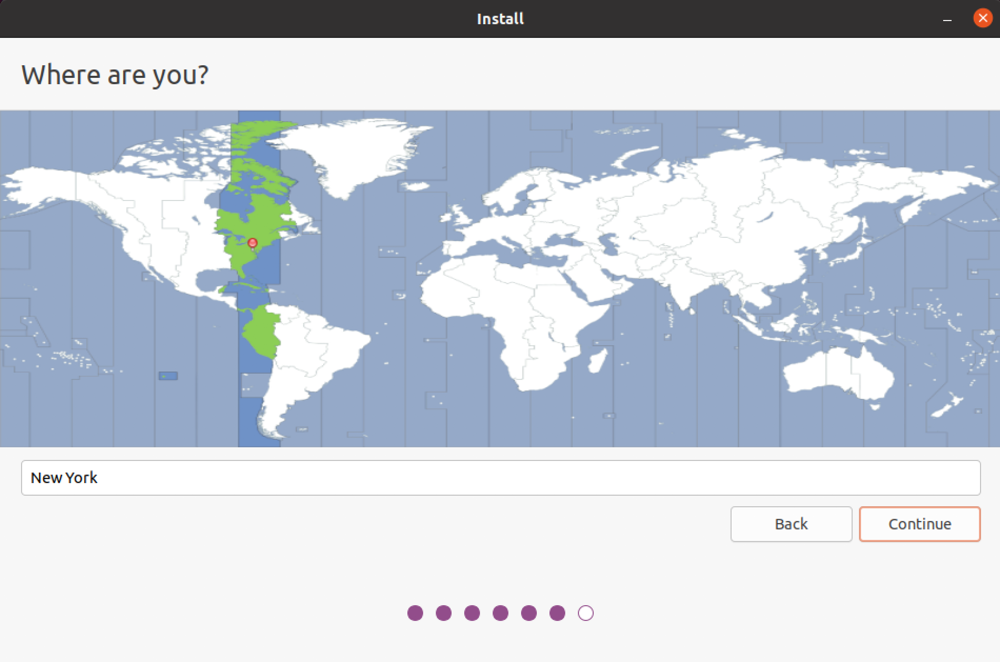

19. Configure hostname and user account:

    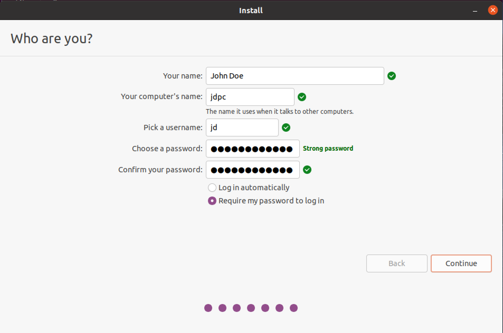

20. When installation starts, enable `grub-mkconfig` and `grub-install` to check
    for encrypted disks.

    **Warning.** This has to be done before the installer reaches bootloader
    installation stage.

    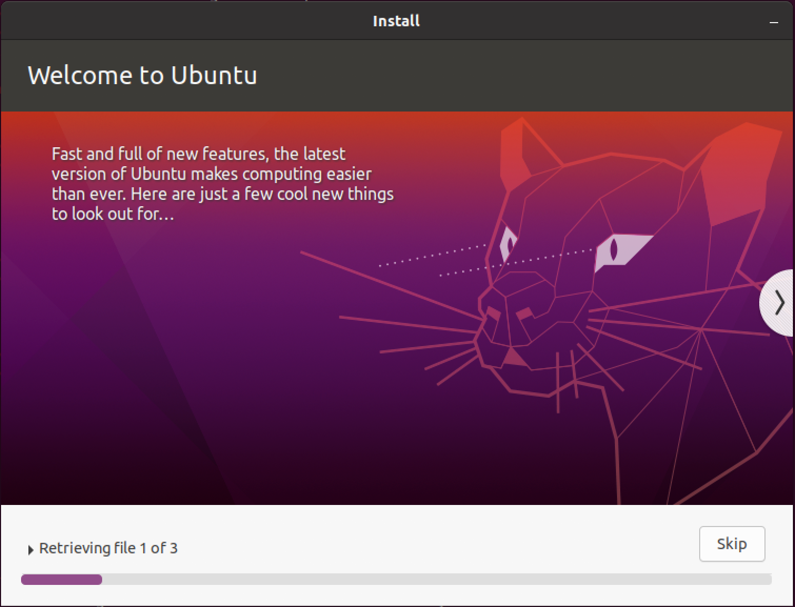

    Run the following commands in terminal:

    ```sh
    while [ ! -d /target/etc/default/grub.d ]; do
        sleep 1
    done; \
    echo "GRUB_ENABLE_CRYPTODISK=y" > /target/etc/default/grub.d/cryptodisk.cfg
    ```

21. When the installation is complete, select "Continue Testing":

    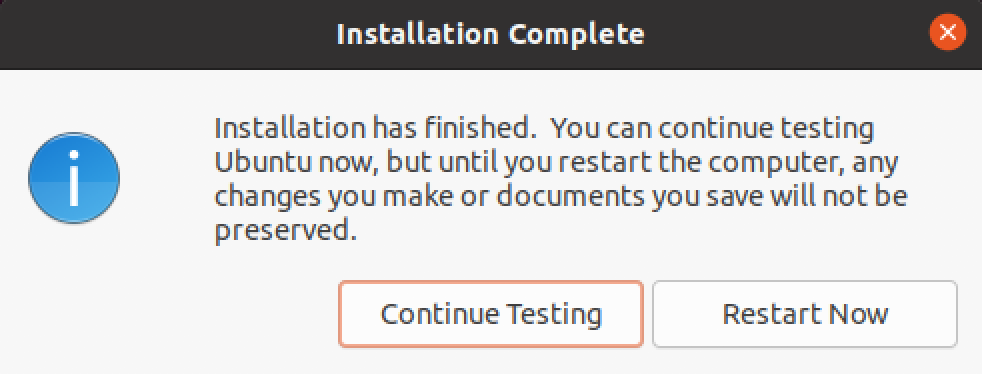

22. Chroot to installed system:

    ```sh
    mount /dev/vg-primary/root /target
    for path in proc sys dev etc/resolv.conf; do
        mount --rbind /$path /target/$path
    done
    chroot /target
    mount --all
    ```

23. Configure encrypted devices to be unlocked automatically.

    Ensure that `cryptsetup-initramfs` package is installed:

    ```sh
    apt install cryptsetup-initramfs
    ```

    Set the following option in `/etc/cryptsetup-initramfs/conf-hook`:

    ```sh
    KEYFILE_PATTERN="/etc/luks/*.key"
    ```

    Create file `/etc/initramfs-tools/conf.d/umask` with the following content:

    ```sh
    UMASK=0077
    ```

    Create and configure keys:

    ```sh
    mkdir --mode=500 /etc/luks
    dd if=/dev/urandom of=/etc/luks/boot.key bs=512 count=1
    dd if=/dev/urandom of=/etc/luks/primary.key bs=512 count=1
    chmod 400 /etc/luks/*.key

    cryptsetup luksAddKey /dev/sda2 /etc/luks/boot.key
    cryptsetup luksAddKey /dev/sda3 /etc/luks/primary.key

    BOOT_UUID=$(blkid --match-tag=UUID --output=value /dev/sda2)
    echo "boot UUID=$BOOT_UUID /etc/luks/boot.key luks" > /etc/crypttab

    PRIMARY_UUID=$(blkid --match-tag=UUID --output=value /dev/sda3)
    echo "primary UUID=$PRIMARY_UUID /etc/luks/primary.key luks" >> /etc/crypttab

    update-initramfs -u -k all
    ```

24. Install `extboot` dependencies:

    ```sh
    apt install rsync
    ```

25. Initialize `extboot` directory:

    ```sh
    mkdir --parents /var/lib/extboot/mnt/esp
    mkdir /var/lib/extboot/mnt/recovery
    ```

26. Initialize backing file for staging ESP:

    ```sh
    dd if=/dev/zero of=/var/lib/extboot/esp.img bs=1M count=1024
    mkfs.vfat -F 32 /var/lib/extboot/esp.img
    ```

27. Configure mounting.

    Set the following `/etc/fstab` file content:

    ```
    /dev/vg-primary/root      /          xfs   defaults  0  0
    /dev/mapper/boot          /boot      ext4  defaults  0  2
    /var/lib/extboot/esp.img  /boot/efi  vfat  x-systemd.requires=extboot-fix-mount.service,loop=/dev/loop78,umask=0077  0  1
    /dev/vg-primary/home      /home      xfs   defaults  0  0
    /dev/vg-primary/swap      none       swap  sw        0  0
    ```

    Create file `/etc/systemd/system/extboot-fix-mount.service` with contents from
    `${project_root}/config/systemd-service/extboot-fix-mount.service`.

    Run the following commands:

    ```sh
    losetup /dev/loop78 /var/lib/extboot/esp.img
    losetup --detach /dev/loop78
    ```

    **Warning.** Without running the specified above `losetup` commands mounting
    of `/var/lib/extboot/esp.img` image fails with the following error message:

    ```
    mount: /boot/efi: failed to setup loop device for /var/lib/extboot/esp.img.
    ```

28. Sync the contents of external and staging ESP partitions:

    ```sh
    umount /boot/efi
    mount /boot/efi
    mount -t vfat -o umask=0077 LABEL=EB-ESP /var/lib/extboot/mnt/esp
    rsync --archive --delete /var/lib/extboot/mnt/esp/ /boot/efi
    ```

29. Create file `/etc/systemd/system/extboot-sync.service` with contents from
    `${project_root}/config/systemd-service/extboot-sync.service`.

30. Create file `/etc/udev/rules.d/99-extboot.rules` with contents from
    `${project_root}/config/udev/99-extboot.rules`.

31. Reboot.
